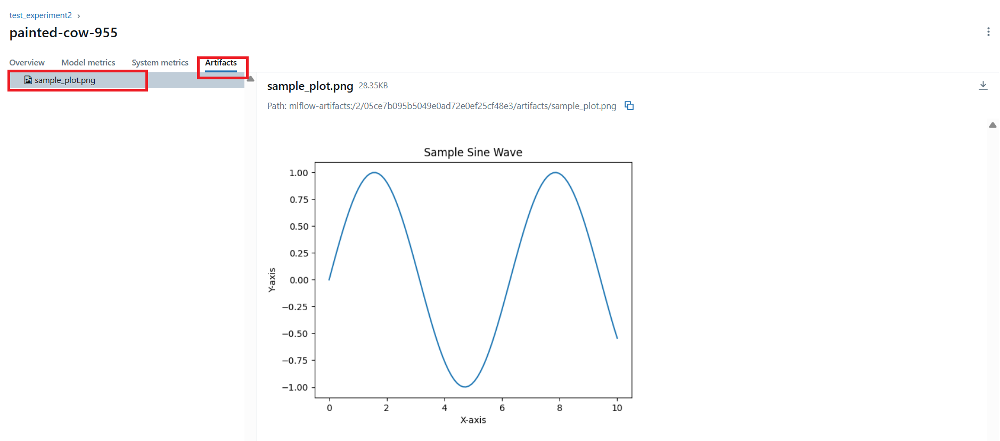

# MLflow: A Machine Learning Lifecycle Platform

[MLflow](https://mlflow.org/) is an open-source platform designed to help machine learning practitioners and teams manage the complexities of the ML lifecycle. It provides tools to make every phase of a machine learning project—development, tracking, deployment, and reproducibility - more manageable and traceable.

## Container image

**Note:** You can use the provided [Containerfile](Containerfile) to build a custom container image or reference your own. Currently, the `03-mlflow-server.yml` deployment file references the image `quay.io/troyer/mlflow-server:latest` in the `spec.containers.image` section of the Deployment YAML.

A prebuilt image is available at: [https://quay.io/troyer/mlflow-server:latest](https://quay.io/troyer/mlflow-server:latest).

## Deployment procedure

1. **Clone** or navigate to [this repository](https://github.com/nerc-project/llm-on-nerc.git).

    To get started, clone the repository using:

    ```sh
    git clone https://github.com/nerc-project/llm-on-nerc.git
    cd llm-on-nerc/mlflow
    ```

2. In the `standalone` folder, you will find the following YAML files that allow you to easily deploy a **MLflow** infrastructure:

    -   **01-mlflow-postgres.yml**: Defines all objects required to setup a standalone **PostgreSQL** database.

        This allow allow you to set your own database info via Secrets:

        -   **database-name:** vectordb  # Change this with your own value

        -   **database-password:** vectordb  # Change this with your own value

        -   **database-user:** vectordb  # Change this with your own value

    -   **02-mlflow-minio.yml**: Defines all objects required to setup a **MinIO** object storage instance:

        -   Deploys a MinIO instance in your project namespace.

        -   Creates one storage bucket within the MinIO instance named as `mlflow-bucket`.

        -   Generates a random **Root User**, which can also be used as the *Access Key*,
            and a **Root User Password**, which serves as the *Secret Key* for accessing
            both the MinIO API and the MinIO Console.

        -   Installs all required network policies.

    -   **03-mlflow-server.yml**: Creates a **Mlflow Server** that connects

You can run this `oc` command: `oc apply -f ./standalone/.` to execute all of the above described YAML files located in the **standalone** folder at once.

```sh
oc apply -f ./standalone/.

secret/mlflow-postgresql-secret created
persistentvolumeclaim/mlflow-postgresql-pvc created
deployment.apps/mlflow-postgresql-deployment created
service/mlflow-postgresql-service created
serviceaccount/mlflow-minio-setup created
rolebinding.rbac.authorization.k8s.io/mlflow-minio-setup-edit created
persistentvolumeclaim/mlflow-minio-pvc created
deployment.apps/mlflow-minio-deployment created
job.batch/create-minio-buckets created
job.batch/create-mlflow-minio-root-user created
service/mlflow-minio-service created
route.route.openshift.io/mlflow-minio-console created
route.route.openshift.io/mlflow-minio-s3 created
deployment.apps/mlflow-deployment created
service/mlflow-service created
route.route.openshift.io/mlflow-route created
```

To delete all resources if not necessary just run `oc delete -f ./standalone/.`.

## Usage

The API is now accessible at the endpoints:

-   defined by your Service, accessible internally on port **5000** using http.

    This is accessible **within the cluster only**, such as from the NERC RHOAI Workbench hosted Jupyter Notebooks or another pod within your project namespace.

    You can use either the service name or the fully qualified internal Hostname for service routing, as shown below:

    -   **Option 1:** Using the service name i.e. http://mlflow-service:5000

    -   **Option 2:** Using the full internal hostname i.e. `http://mlflow-service.<your-namespace>.svc.cluster.local:5000`

-   defined by your Route, accessible externally through https, e.g. `https://mlflow-route-<your-namespace>.apps.shift.nerc.mghpcc.org`.

**Accessing MLFLow GUI Dashboard:**

Go to [`https://mlflow-route-<your-namespace>.apps.shift.nerc.mghpcc.org`](https://mlflow-route-<your-namespace>.apps.shift.nerc.mghpcc.org). This show the MLflow GUI as shown below:


## Examples

Set up your Python Virtual environment and install all required packages by running: `pip install -r examples/requirements.txt` inside the activated virtual environment.

Then you can run the following python experiment scripts:

-   **01-test_remote.py**: Please open and edit the Python file to set the tracking URI to your own remote MLflow server and then run:

    ```sh
    (venv)$ python examples/01-test_remote.py
    2025/05/15 18:36:13 INFO mlflow.tracking.fluent: Experiment with name 'test_experiment1' does not exist. Creating a new experiment.
    Run logged successfully!
    🏃 View run nebulous-ant-535 at: https://mlflow-route-<your-namespace>.apps.shift.nerc.mghpcc.org/#/experiments/1/runs/55f01904bd914be880fe9fd1fdbcc515
    🧪 View experiment at: https://mlflow-route-<your-namespace>.apps.shift.nerc.mghpcc.org/#/experiments/1
    ```

-   **02-test_remote.py**: Please open and edit the Python file to set the tracking URI to your own remote MLflow server. Also, you need to set the S3/MinIO endpoint URL to your MinIO server API and the S3/MinIO credentials i.e. `AWS_ACCESS_KEY_ID` and `AWS_SECRET_ACCESS_KEY` and then run:

    ```sh
    (venv)$ python examples/02-test_remote.py
    https://mlflow-route-<your-namespace>.apps.shift.nerc.mghpcc.org
    2025/05/15 18:36:34 INFO mlflow.tracking.fluent: Experiment with name 'test_experiment2' does not exist. Creating a new experiment.
    Artifact sample_plot.png logged successfully!
    🏃 View run painted-cow-955 at: https://mlflow-route-<your-namespace>.apps.shift.nerc.mghpcc.org/#/experiments/2/runs/05ce7b095b5049e0ad72e0ef25cf48e3
    ```


By clicking on the **test_experiment2** run in the MLflow GUI, you can verify that the experiment has successfully stored the artifact:



**Very Important**: There are ways we can improve this setup - for example, by adding basic authentication to the MLflow GUI to ensure that only authorized users can access it.
